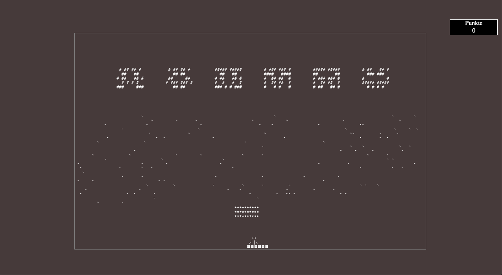

# Dokumentation Stefan Reich und Ligia Dietze 

Hier sieht man unser selbstgecodetes Space Invader Spiel. Dabei kann man mit dem kleinen Raumschiff die angreifenden Invaders abschießen. Das Ganze wurde im Rahmen der Programmierpsrachen Vorlesung an der HfG Gmünd programmiert. 
Die Basis für das Spiel, wie auch Grundfunktionen (Raumschiff, Schießen und das Spielfenster) wurden von unserem Dozenten Florian Geiselhart vorprogrammiert. Unsere Aufgabe bestand darin Space Invaders zu generieren, sie bewegen und explodieren zu lassen, sowie einen Score einzubauen.

## Usage / Benutzung

Um dieses Spiel zu Spielen muss man nur die github Repo Herunterladen und die index html in einem Browser öffnen. 
Gesteuert wird das ganze mit den Pfeiltasten und der Leertaste zum Schießen. Bisher verschwinden jedoch noch alle Spaceinvader auf einmal. Das liegt daran dass wir noch keine Funktion implementiert haben, die die einzelnen Invaders explodieren lässt. 

## Structure / Aufbau

Wir sind bei der Struktur weniger systematisch, sondern eher pragmatisch rangegangen. 

Zuerst haben wir die Space Invaders generiert

**function generateInvader**

	function generateInvader(width, height) {

			let invader = [];
			for (let y = 0; y < height; y++) {
				invader[y] = " ".repeat(InvaderWidth * 2 + 1);
				for (let x = 0; x < InvaderWidth; x++) {
					let randomNumber = Math.random();
					if (randomNumber <= 0.6) {
						invader[y] = setCharsAt(invader[y], x, "#");
						invader[y] = setCharsAt(invader[y], 2 * InvaderWidth - x, "#")
					}
				}
			}
			return invader;
		}

* width, height: Invadergröße
* Math.random() generiert bei jedem reload neue einzigartige Formen
* desweiteren definieren wir das "#" als Zeichen und vergrößern den Invader einmal um die InvaderWidth

**function render**

function render() {
			run++
			if (run >= gameSpeed) {
				run = 0;
				if (xoffset == 0 || xoffset == ((cols - InvaderWidth * 2) - 101)) {
					yoffset++;
					invaderDirection = invaderDirection * (-1);
					xoffset = xoffset + invaderDirection;
				} else {
					xoffset = xoffset + invaderDirection;
				}
			}

      * hier justieren wir die Invaders auf dem Bildschirm und generieren die Richtung, sowie den Richtungswechsel 

**function renderInvaders**

function renderInvaders(posX, posY, invaders) {
			for (var j = 0; j < invaders.length; j++) {
				for (var i = 0; i < invaders[j].length; i++) {
					renderStr = setCharsAt(renderStr, xyToStringPos(posX, posY + i), invaders[j][i]);

				}
				posX = posX + 10 * 2;
			}
		}

    * diese Funktion sorgt für die richtige Positionierung des Invaders

**function renderBullets**

    ...

    if (renderStr[xyToStringPos(bullet.x, bullet.y - 1)] == '#') {
					for (let i = 0; i < 6; i++) {
						invaders[i] = [];
					}
					invaders[2] = ["peng!"]
					score = 1; 

    * Hier wird die Bullet gerendert und hier findet auch die Hit detection mittel if schleife statt. sobald sich die bullet       an der stelle eines "#" symbols befindet greift die if schleife. und löscht den invaders array und ersetzt ihn an stelle       zwei mit dem Wort "peng!". gleichzeitig wird in den score array eine eins geschrieben.

**Scoreboard**

punkte

**unsere pseudoRow**

**new game**

   invaders.push(generateInvader(8, 5));
			invaders.push(generateInvader(8, 5));
			invaders.push(generateInvader(8, 5));
			invaders.push(generateInvader(8, 5));
			invaders.push(generateInvader(8, 5));
			invaders.push(generateInvader(8, 5));

Eine funktion die zum spielstart ausgeführt wird. Hier werden die invaders mit jeweils 5 zeichen höhe und 8 zeichen breite in den Array Invaders geschrieben.

## ToDos

* Eine bessere Lösung wäre eine Klasse zu erstellen, InvaderRow, in der alle Invader aus eine Reihe
zusammengefasst werden, damit könnten die Positionen der Invaders besser ermittelt werden
* zudem könnten mit einer zugeteilten Invader Id einzelne Invaders abgeschossen werden
